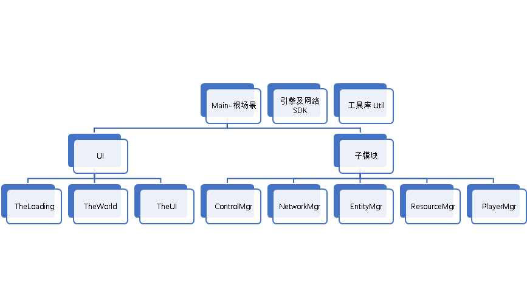

## 简介
一个将RTS与球球大作战融合的IO类游戏
### 背景设定
《增城》(英文名：Zenith)，是一款大作战与即时战略结合的创新游戏，玩法完全原创，游戏设定玩家扮演为《三体》中宇宙低光速“黑域”中的一个文明，为了争夺唯一的能量资源而进行的合纵连横，采取合适的生存与发声策略让自己的文明活到最后，在宇宙历史上留下前列的姓名。
### 玩法设定
- 基于Html5开发，通过Html5相关API实现。
- 为多人联机游戏，使用第三方SDK，无需单独服务端和服务器设备。
- 为网页游戏，用户（或玩家，下文中两词同义）只需要加入网站即可游玩。
- 运行环境为个人计算机上的Chromium系浏览器。
- 操作设备为鼠标键盘。
- 结合“大作战”游戏风格与即时战略游戏风格。
- 设定游戏场景为2D平面地图，并在地图上以小圆点的形式按照规则生成唯一一种资源。
- 设定游戏中存在不同属性的若干兵种，设定基地为一种特殊兵种，具有兵种的基础属性以及生成其他兵种的唯一属性。
- 设定兵种属性包括属性值和能力两部分；属性值：生命值、移动速度、采集速度、攻击力、能量值（兵种的价值，包括兵种自身价值与收集存储的资源）；能力：采集资源、攻击其他玩家基地与士兵以及兵种自身特殊技能。
- 设定玩家在游戏中操纵基地，通过采集资源让基地逐渐升级，通过基地生产不同兵种的士兵单位以完成采集资源、攻击其他玩家等行为，从而获得胜利。
- 游戏画面以抽象色彩几何图形为主，风格生动简洁。
- 开发排行榜、游戏内信息传达系统，如表情系统、标准化消息等，以增强游戏社交性。
- 创造游戏的背景设定，为游戏赋予文化属性，传达出积极向上、热爱生活的价值观。
## 开发环境
- 游戏引擎: Egret 2.4；
- 编译打包工具Vite 2.0；
- 开发语言 TypeScript/ JavaScript；
- 开发工具 Idea 2021.1；
- 运行调试 Chrome 89；
- UI设计 FairyGui 2021.1.0  运行SDK: FairyGUI-egret@25f2a12；
- 多人联机库 LeanCloud Play SDK JS 1.0.0；
- 设计文档编写 Microsoft Office Word 2020。
### 系统架构

更多文档见assets下docx文档(todo: 待补充)
### 指令
```shell
yarn #install
vite #serve
vite build #build
yarn doc #doc
```
### 在线DEMO
todo: 待补充